# Báo cáo cá nhân — K4-L3B Day 13 Monitoring & LLMOps

> Mỗi học viên hoàn thiện một file duy nhất này. Khi dẫn evidence, dùng đường dẫn tương đối, ví dụ `evidence/07-trace-waterfall.png`.

## 1. Thông tin học viên

- **Họ và tên:** Vũ Minh Điềm
- **MSSV:** 2A202602858
- **Lớp:** K4-L3B
- **Repository URL:** https://github.com/diemvu12369/K4-L3B-Day13-VuMinhDiem-2A202602858-Monitoring-LLMOps
- **Commit SHA cuối:** commit cuối trên nhánh `main` (SHA nộp trên LMS); tests trong `evidence/01-pytest.txt` chạy trên commit ghi ở dòng đầu file đó.
- **Challenge ID:** `day13-k4-l3b-monitoring-llmops-v1`
- **Tên project Langfuse cá nhân:** `K4-L3B-Day13-VuMinhDiem-2A202602858-Monitoring-LLMOps` (đặt theo hướng dẫn riêng của lớp)

## 2. Evidence index

| # | Evidence | Đường dẫn |
|---|---|---|
| 01 | Pytest cuối | [evidence/01-pytest.txt](evidence/01-pytest.txt) |
| 02 | Log validator | [evidence/02-log-validator.txt](evidence/02-log-validator.txt) |
| 03 | Dashboard validator | [evidence/03-dashboard-validator.txt](evidence/03-dashboard-validator.txt) |
| 04 | Structured log | 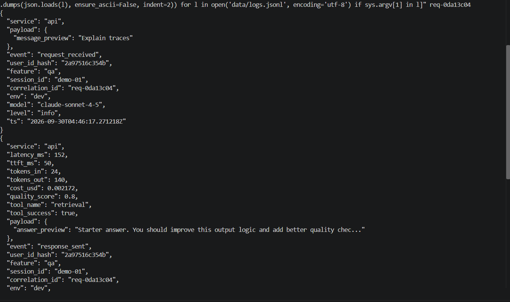 |
| 05 | PII redaction | 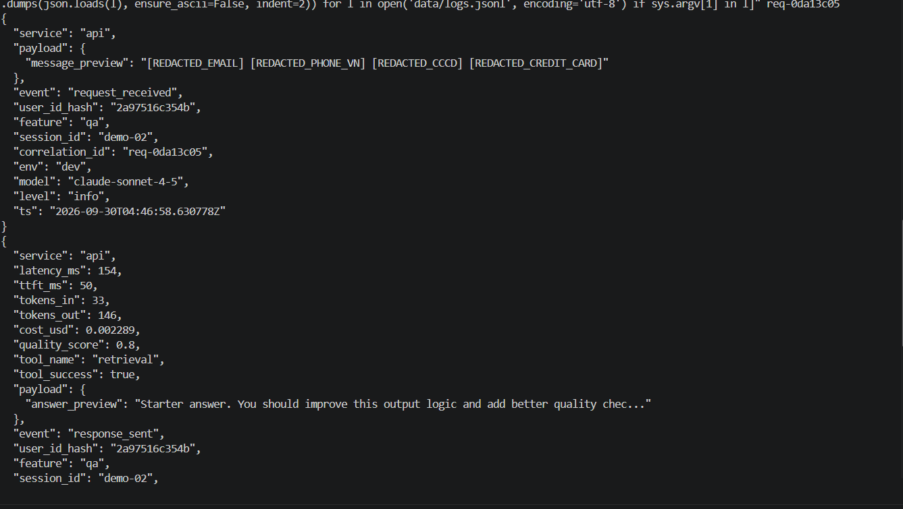 |
| 06 | Trace list | 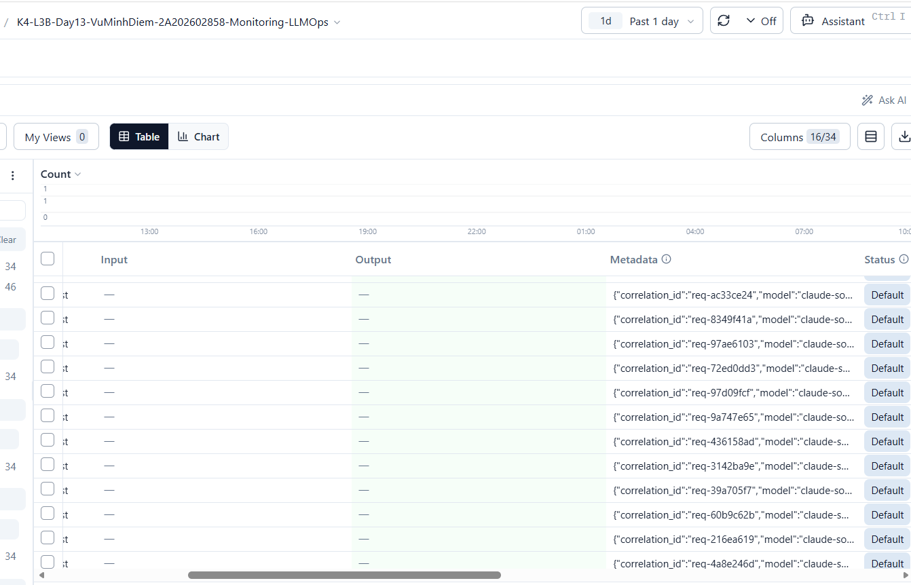 |
| 07 | Trace waterfall | 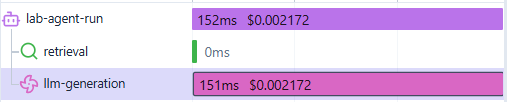 |
| 08a | Trace metadata (root) | 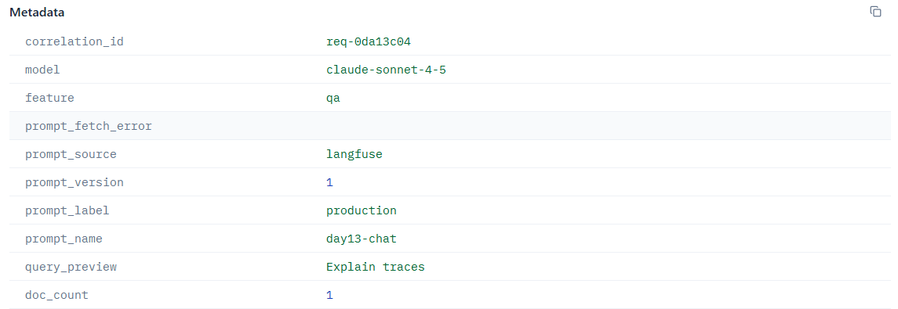 |
| 08b | Trace metadata (generation) | 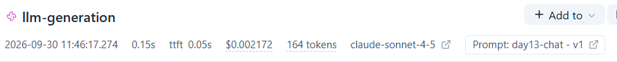 |
| 09 | Prompt versions |  |
| 10a | Sau khi promote `production` → v2 | 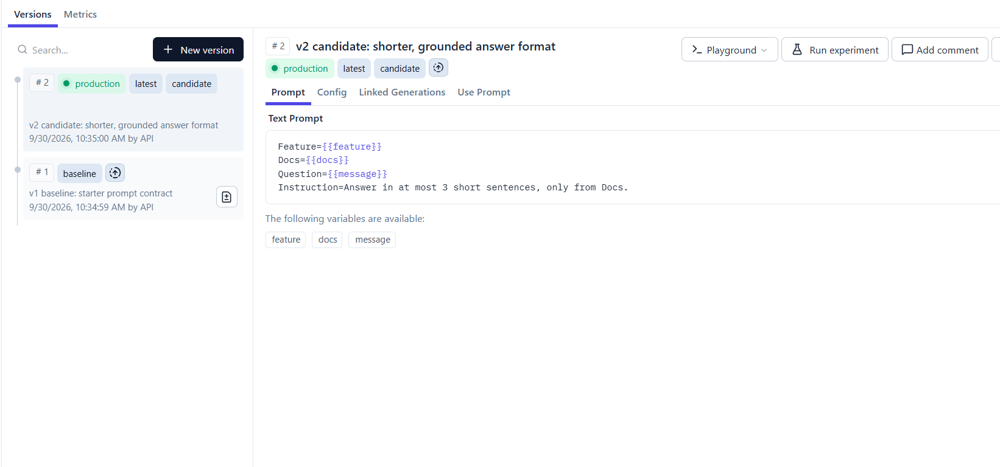 |
| 10b | Sau khi rollback `production` → v1 | 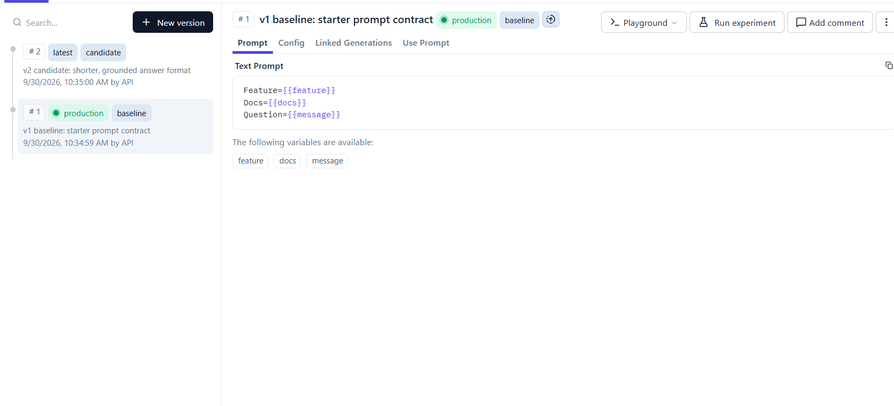 |
| 11 | Dashboard runtime | 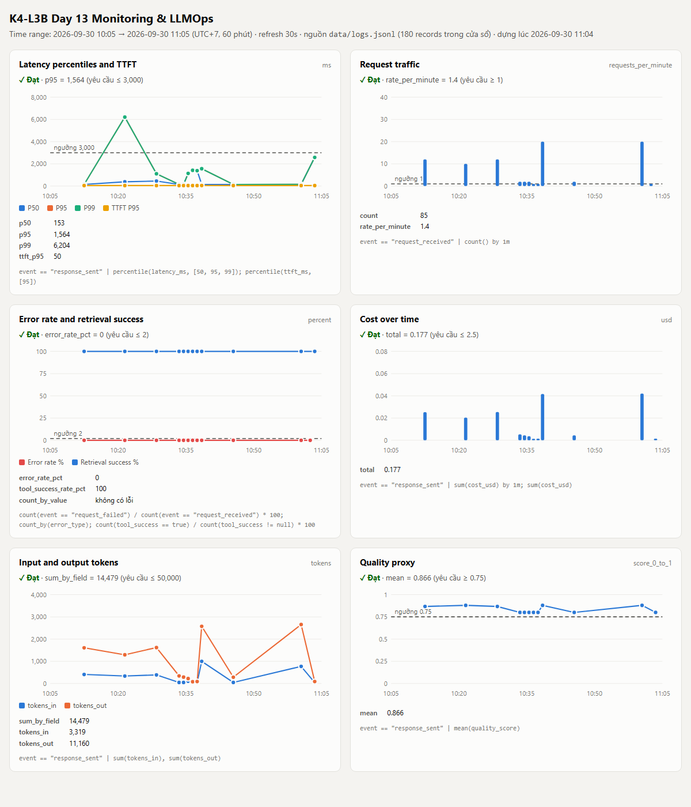 |
| 12 | Incident metric | 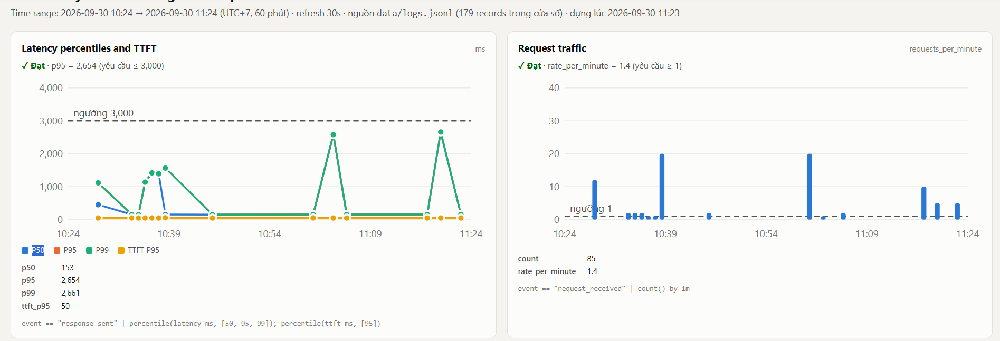 |
| 13 | Incident log | 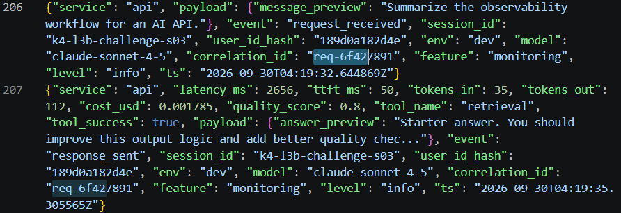 |
| 14 | Incident trace | 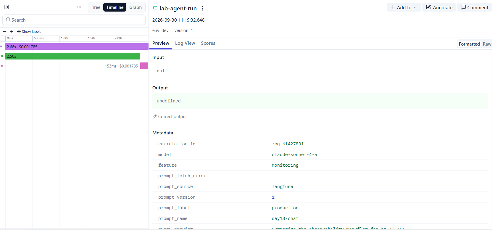 |

Output baseline CP0/CP1 dạng text: [evidence/cp0-cp1-results.txt](evidence/cp0-cp1-results.txt).

## 3. Kết quả kỹ thuật

| Nội dung | Baseline | Kết quả cuối | Nhận xét |
|---|---|---|---|
| `validate_logs.py` | 30/100 (21 records; 20 thiếu field bắt buộc và enrichment, 0 correlation ID) | 100/100 (21 records, 10 correlation ID, 0 thiếu field, 0 PII) | Log cũ chuyển ra ngoài repo, restart API, chạy lại `load_test.py` rồi validate |
| `validate_dashboard.py` | HỢP LỆ: 6/6 panel | HỢP LỆ: 6/6 panel | Contract validator; dashboard runtime ở ảnh 11 |
| `pytest` | Không chạy được ở Python mặc định (thiếu `structlog`, `langfuse`) | 28 passed trong `.venv` | Thêm test PII, middleware/correlation ID và child observations |
| Số traces hợp lệ | 0 (chưa cấu hình Langfuse) | ≥ 33 trace có đủ `lab-agent-run` → `retrieval` + `llm-generation` | Mỗi trace có metadata `correlation_id` khớp log |
| Số PII leak | Không kiểm chứng được (log thiếu scrub processor) | 0 | Log validator + test PII; trace chỉ lưu preview đã scrub |
| Latency P95 / TTFT P95 | Không đo (chưa có dashboard) | Bình thường: P50 ~153ms, TTFT P95 50ms; khi incident: P95 2661ms | Server đo trong `agent.run`; client đo cao hơn do request xếp hàng |
| Retrieval success rate | Không đo | 100% (0 `request_failed`) | Panel Errors |

## 4. Logging và PII

- **Cách tạo/nhận và truyền correlation ID:** nhận `x-request-id` nếu khớp `req-<8-hex>`, nếu không tạo ID mới; bind trong structlog contextvars và trả lại qua response header/body.
- **Các metadata được ghi vào structured log:** `user_id_hash`, `session_id`, `feature`, `model`, `env` và `correlation_id`.
- **Cách bảo đảm PII được scrub trước khi ghi:** `scrub_event` đệ quy qua các chuỗi ở mọi field trước `JsonlFileProcessor` và JSON renderer.
- **Cách kiểm chứng kết quả:** PII tests cho email, điện thoại VN, CCCD, thẻ; test event lồng nhau và middleware; log validator cuối đạt 100/100 với 0 PII leak.
- **Request dùng cho evidence:** ảnh 04 là `req-0da13c04` (message "Explain traces", `latency_ms` 152), trace `0c8feb2550b7130a201ff8cd57a9920f` dùng cho ảnh 07/08a/08b; ảnh 05 là `req-0da13c05` với message chứa email, số điện thoại VN, CCCD và số thẻ giả theo đề (lệnh ở mục 8.2) → log chỉ còn `[REDACTED_EMAIL] [REDACTED_PHONE_VN] [REDACTED_CCCD] [REDACTED_CREDIT_CARD]` (trace `8a8be4cedd4d666b9f41373131754b6b`).

## 5. Tracing và prompt versioning

- **Cách xác nhận traces do chính tôi tạo trong project cá nhân:** tự chạy `load_test.py --concurrency 5` (2 lượt) và các request prompt demo bằng key của project cá nhân; kiểm tra qua Langfuse API: ≥ 33 trace có đủ root + retrieval + generation, mỗi trace mang `correlation_id` trùng với `data/logs.jsonl`.
- **Cấu trúc root/retrieval/generation observations:** `lab-agent-run` (agent, root, metadata prompt/doc_count/query preview đã scrub) → `retrieval` (retriever, input `query_preview` đã scrub, output `doc_count`) và `llm-generation` (generation, model `claude-sonnet-4-5`, link tới prompt Langfuse, `usage_details` input/output, `cost_details` input/output/total, `completion_start_time` = TTFT). Không capture raw input/output; chỉ preview qua `summarize_text` (đã scrub PII).
- **Cách nối trace với log:** middleware sinh/nhận `x-request-id` → `correlation_id` được bind vào log và truyền vào `propagate_attributes(metadata=...)` của trace, cộng thêm trong metadata của `retrieval`/`llm-generation`; tìm trace bằng metadata `correlation_id` hoặc từ log line.
- **Prompt name:** `day13-chat` (text prompt, giữ đủ `{{feature}}`, `{{docs}}`, `{{message}}`).
- **Version/label baseline:** version 1, labels `baseline` + `production` ban đầu (template starter).
- **Version/label candidate:** version 2, label `candidate`; thêm dòng `Instruction=Answer in at most 3 short sentences, only from Docs.` → `tokens_in` cùng input tăng từ 45 lên 61.
- **Trace ID của mỗi version:** cùng input "Explain how metrics, logs and traces work together for monitoring":
  - `baseline` → v1: trace `504074fc4dbdbe565933a2c5aa56ab0a` (`req-b1000004`)
  - `candidate` → v2: trace `c52beebf7f5858185ae390cc3125038d` (`req-c2000002`)
  - `production` sau khi promote → v2: trace `d58dd521306421d8cf146a1f4e80d1ac` (`req-a2000003`)
  - `production` sau khi rollback → v1: trace `e72cc7c25c3d541c5440b428018c8759` (`req-a1000005`, `tokens_in` về lại 45)
- **Cách promote và rollback `production`:** app chỉ đọc `LANGFUSE_PROMPT_NAME`/`LANGFUSE_PROMPT_LABEL`, không sửa code. Promote: gắn label `production` cho version 2 (Langfuse tự gỡ label khỏi version 1). Rollback: gắn lại `production` cho version 1. Prompt cache TTL 60s nên chờ ≥60s hoặc restart API rồi chạy lại request để xác nhận `prompt_version` trong trace.

## 6. Dashboard, SLO và alerts

- **Dashboard và sáu panel:** `python scripts/build_dashboard.py [--watch]` đọc `data/logs.jsonl` và `config/dashboard.yaml`, ghi `data/dashboard.html` (time range 60 phút, refresh 30s, đơn vị và đường threshold từ contract, trạng thái Đạt/Vượt ngưỡng từng panel). Sáu panel: Latency (P50/P95/P99 + TTFT P95), Traffic (count, request/phút), Errors (error rate %, breakdown `error_type`, retrieval success %), Cost (USD/phút, tổng), Tokens (tokens_in/tokens_out), Quality (mean). `validate_dashboard.py`: 6/6. Baseline lúc 10:43: P50 154ms, P95 1564ms, P99 6204ms (request đầu khi mạng tới Langfuse chậm), TTFT P95 50ms, error 0%, retrieval success 100%, tổng cost 0.129 USD, 10,579 tokens, quality 0.865.
- **SLO và lý do chọn:** `fast_successful_requests`: 99.5% request có `response_sent` với `latency_ms <= 3000` trong 28 ngày. Giữ ngưỡng 3000ms vì P95 thực tế ~1.5s (có tracing Cloud), còn khoảng đệm ~2x nhưng vẫn bắt được retrieval chậm thêm ~2.5s/request.
- **Cách tính error budget:** 100% − 99.5% = 0.5%. Với 10,000 request/28 ngày → tối đa 50 request lỗi hoặc > 3000ms. Request lỗi (không có `response_sent`) cũng tính là bad event.
- **Ba alert và runbook tương ứng:** (Slack `#k4-l3b-alerts`, owner `student-2A202602858`, chi tiết trong `docs/alerts.md`)
  1. `HighLatencyP95` (warning, 5m): P95 latency > 3000ms → runbook `docs/alerts.md#alert-1`.
  2. `HighErrorRateOrRetrievalFailure` (critical, 5m): error rate > 2% hoặc retrieval success < 90% → `#alert-2`.
  3. `CostPerRequestSpike` (warning, 15m): cost trung bình > 0.004 USD/request (2x baseline) hoặc > 0.104 USD/giờ (guardrail 2.5 USD/ngày) → `#alert-3`.

> Ví dụ cách viết error budget: "SLO 99.5% trong 28 ngày nghĩa là error budget 0.5%. Nếu workload có 10,000 request thì tối đa 50 request được phép lỗi hoặc chậm hơn ngưỡng SLO."

## 7. Điều tra challenge

- **Challenge ID:** `day13-k4-l3b-monitoring-llmops-v1` (cohort K4, seed 1312, feature bị ảnh hưởng `monitoring`, `latency_threshold_ms` 2000). Chạy bằng `inject_incident.py` + `load_test.py --challenge --concurrency 5`.
- **Khoảng thời gian điều tra:** 11:19:32–11:19:46 (UTC+7) ngày 2026-09-30 (04:19 UTC). Mốc trước sự cố: 11:17; xác nhận hồi phục: 11:22:50.
- **Triệu chứng từ metrics:** panel Latency: 5/5 request `monitoring` lúc 11:19 có latency 2654–2661ms (vượt ngưỡng challenge 2000ms), so với 152–154ms lúc 11:17 (chậm ~17x); P95 toàn cửa sổ tăng 1564 → 2656ms, `/metrics` báo `latency_p95` 2661ms. TTFT P95 giữ 50ms; error rate 0%, retrieval success 100%, token/cost/quality không đổi → vấn đề là độ trễ trước bước generation, không phải lỗi hay LLM.
- **Log line và correlation ID liên quan:** `event=response_sent`, `correlation_id=req-6f427891`, `feature=monitoring`, `latency_ms=2656`, `ttft_ms=50`, `tool_name=retrieval`, `tool_success=true`, `ts=2026-09-30T04:19:35Z`. Bốn request cùng đợt: `req-3a79c0fe`, `req-65423bda`, `req-b4a9ae8c`, `req-06fd8ddf` (2654–2661ms).
- **Trace ID và span gây ảnh hưởng:** trace `d04bfd86c37e8243ce458854665ae5fe` (metadata `correlation_id=req-6f427891`): `lab-agent-run` 2657ms → span `retrieval` **2501ms (94%)**, `llm-generation` 153ms (bình thường), không có observation lỗi.
- **Root cause:** bước retrieval (vector store/RAG) bị chậm thêm ~2.5s mỗi request trong đợt challenge (incident `rag_slow` bật toàn service trong đợt challenge; mọi request của đợt thuộc feature `monitoring` nên chỉ feature này bị ảnh hưởng); generation và prompt không thay đổi. Metric (latency tăng, TTFT không đổi), log (`latency_ms` ~2656 với `tool_success=true`) và trace (span `retrieval` 2501ms) cùng chỉ về một nguyên nhân.
- **Fix action:** tắt nguồn gây chậm của retrieval (`inject_incident.py --disable`) và chạy lại đúng 5 query challenge: latency về 152–156ms (`req-95b75424`, `req-e825be96`, `req-8ef2309e`, `req-3cf15313`, `req-829a37db`).
- **Preventive measure:**
  1. Log thêm `retrieval_latency_ms` và alert khi P95 retrieval > 1000ms trong 5 phút, để phát hiện trước khi chạm SLO 3000ms (đợt này P95 2661ms vẫn dưới ngưỡng SLO nên `HighLatencyP95` không bắn, dù đã vượt ngưỡng challenge 2000ms).
  2. Đặt timeout cho retrieval (vd. 800ms) và fallback sang trả lời không context thay vì chờ.
  3. Chạy `agent.run` ngoài event loop (`run_in_threadpool`/endpoint `def`): client đo 8–13s trong khi server đo 2.6s vì các request đồng thời bị xếp hàng sau lệnh blocking.

> Gợi ý cách viết ngắn, không thay cho evidence thực tế: "Metric cho thấy `[latency/error/cost/quality]` bất thường trong `[khoảng thời gian]`. Log line `[event]` có `correlation_id=[...]` đại diện cho request bị ảnh hưởng. Trace cùng `correlation_id` cho thấy span `[retrieval/generation/prompt/tool]` có dấu hiệu `[chậm/lỗi/token tăng]`. Root cause là `[nguyên nhân suy ra từ evidence]`. Fix action là `[hành động khôi phục]`; preventive measure là `[alert/runbook/test/guardrail để ngăn tái diễn]`."

## 8. Giải thích và tự đánh giá

- **Một quyết định kỹ thuật quan trọng và lý do:** không gửi raw prompt/output lên Langfuse (`capture_input/output=False`), chỉ gửi `query_preview`/`prompt_preview`/`answer_preview` đã qua `summarize_text` (scrub PII) cùng metadata an toàn; token và cost gửi qua `usage_details`/`cost_details` của observation `generation`. Lý do: trace là nơi dễ lộ PII nhất vì chứa nguyên văn prompt, trong khi điều tra chỉ cần thời lượng span, prompt version, token/cost và `correlation_id`.
- **Một lỗi/blocker đã gặp:** Python mặc định thiếu dependencies; key Langfuse bị điền ngược (public/secret) và mạng timeout khi export span.
- **Cách tìm nguyên nhân và xử lý:** cài `requirements.txt` trong `.venv`; kiểm tra prefix `pk-lf-`/`sk-lf-` và `auth_check()`, đổi mạng rồi chạy lại load test, xác nhận trace qua Langfuse API.
- **Cách hiểu luồng Metrics → Logs → Traces:** metrics trả lời "có vấn đề gì và từ lúc nào" (latency 11:19 tăng từ ~153ms lên ~2656ms, các panel khác bình thường); logs trả lời "request nào" (lọc `response_sent` có `latency_ms > 2000`, lấy `req-6f427891`); trace cùng `correlation_id` trả lời "bước nào" (`retrieval` 2501ms / 2657ms). Mỗi bước thu hẹp phạm vi cho bước sau, nên không phải đoán hoặc mở trace ngẫu nhiên.
- **Vai trò của prompt version, token/cost, SLO hoặc rollback trong vận hành LLM:** prompt là một phần của hệ thống giống code/config: đổi prompt làm thay đổi token, cost và chất lượng (v2 làm `tokens_in` tăng 45 → 61 với cùng input). Ghi `prompt_version` vào trace cho biết request dùng version nào; label `production` cho phép promote/rollback mà không deploy lại code. SLO/error budget biến "chậm" thành con số có thể đo và alert.
- **Điều quan trọng nhất đã học:** observability chỉ hữu ích khi ba nguồn dữ liệu nối được với nhau bằng cùng một ID; thiếu `correlation_id` thì metric, log và trace là ba mảnh rời.
- **Hạn chế hoặc phần chưa hoàn thành, nếu có:** dashboard là HTML tĩnh sinh từ `data/logs.jsonl` (tự refresh 30s), không phải Grafana; log chưa có `retrieval_latency_ms` riêng nên phải mở trace mới thấy bước chậm; endpoint `/chat` chạy code blocking trong `async def` nên request đồng thời bị xếp hàng (client đo 8–13s khi server đo 2.6s).

## 9. Checklist trước khi nộp

- [x] Kết quả và evidence thuộc commit SHA cuối.
- [x] Tất cả ảnh/output mở được bằng đường dẫn tương đối.
- [x] Incident evidence nối đúng metric → log → trace.
- [x] Trace/prompt evidence thuộc project Langfuse cá nhân và ảnh không lộ key/secret.
- [x] Repository chạy lại được theo README.
- [x] Không có secret, API key, PII thô hoặc evidence của người khác/lớp khác.
- [ ] URL repo và commit SHA cuối đã được nộp trên LMS/Codelabs.
